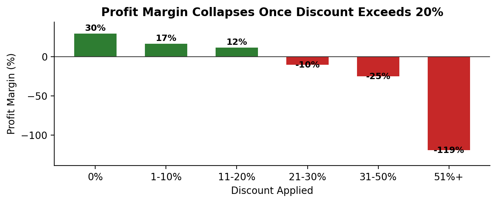

# 📊 Superstore Sales Analytics — Data Warehouse, BI Dashboard & Insight Memo

An end-to-end sales analytics project on the public Superstore dataset (9,994 transactions, 2014–2017): a Star Schema data model, an interactive Power BI dashboard, and a data-driven insight memo that quantifies a real margin leak in the business's discounting policy.

---

## 🔍 Featured Insight: Discounting Above 20% Is Turning Profitable Orders Into Losses

**Full memo:** [`insight-memo-discount-impact.pdf`](./insight-memo-discount-impact.pdf)

Analyzed the relationship between discount level and profit margin across all 9,994 line items and found a clean, consistent breakpoint:

| Discount Applied | Sales | Profit | Margin |
|---|---|---|---|
| 0% | $1,087,908 | $320,988 | +29.5% |
| 1–10% | $54,369 | $9,029 | +16.6% |
| 11–20% | $792,153 | $91,756 | +11.6% |
| 21–30% | $103,227 | −$10,369 | **−10.0%** |
| 31–50% | $195,315 | −$48,448 | **−24.8%** |
| 51%+ | $64,229 | −$76,559 | **−119.2%** |

**Key numbers:**
- Orders discounted above 20% generated **$362,770** in sales but produced a combined **−$135,376** in losses (−37.3% margin on that slice of the business).
- **Tables** is the sharpest single example: $206,966 in sales, **−$17,725 net loss** (−8.6% margin), at an average discount of 26.1% — squarely inside the loss zone.
- **18.7%** of all line items (1,871 of 9,994) currently operate at a loss, totaling **−$156,131** against the business's total profit of $286,397.

**Recommendation:** Cap discounting on Tables and other loss-making sub-categories below the 20% threshold where margin turns negative, or require documented justification for exceptions. Monitor margin by discount band — not just by category or region — to catch this pattern earlier in future reporting cycles.



---

## 🏗️ Project Structure

- **Data model:** Star Schema (fact and dimension tables) supporting fast, scalable analysis of the retail sales dataset
- **Cleaning/validation:** Python (Pandas) — completeness and consistency rules enforced before analysis
- **Dashboard:** Power BI, with KPI tracking and drill-down views for category, region, and segment performance
- **Insight memo:** Python (Pandas) analysis translated into a one-page, stakeholder-facing decision memo

## 🛠️ Tools

Python · Pandas · NumPy · SQL · PostgreSQL · Power BI · Excel

## 📁 Files

```
Sales-Analysis-Dashboard/
├── Sample - Superstore.csv          # Source dataset
├── [Power BI dashboard file]
├── insight-memo-discount-impact.pdf # One-page insight memo (featured finding above)
├── discount_margin_chart.png        # Supporting chart
└── README.md
```

## 📝 Methodology

Full analysis performed in Python (Pandas) on the public Superstore sample dataset. All figures in the memo above are directly reproducible from `Sample - Superstore.csv` in this repo.
